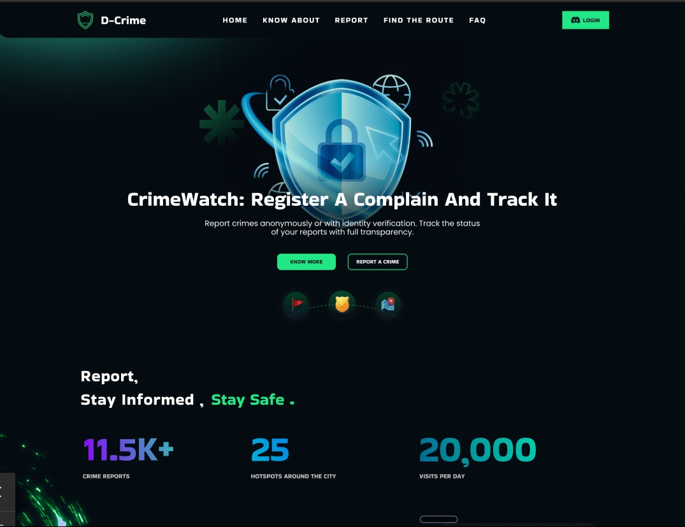

   
   
   <h1 align="center"> D-CRIME </h1>
   <h3 align="center"> Report, Stay safe, Stay Informed! </h3>
   

   ## what is D-Crime all about ?
   ### Welcome to D-Crime, Our Website ensure a safe journey by staying informed about your surroundings. With SafeZone, simply enter your starting and destination locations, and we'll provide a comprehensive analysis of crime rates along your route. Our advanced system identifies areas with high crime density, highlighting potential danger zones. Additionally, we suggest alternative, safer paths to help you avoid these hotspots. Stay updated with real-time safety alerts tailored to your journey, empowering you to make informed decisions and travel with confidence. Your safety is our priority, and we're here to help you navigate through the city securely.
   

   <h2> Features 🚀</h2>
   <h3> 1. Crime Tracer </h3>
   <h3> 2. HitSpotter </h3>
   <h3> 3. SafeZone Alert </h3>
   <h3> 4. Router Space </h3>

   

   <h2> Technologies Used! 👨‍💻  </h2>

   <h3> 1. MERN stack </h3>
   <h3> 2. Avalanche</h3>
   <h3> 3. AIML- Python, Numpy, Pandas </h3>
   <h3> 4. Solidity </h3>

   <h2> Need for D-Crime </h2>

   <h3> 1. Rising crime rates in urban areas </h3>
   <h3> 2. Lack of real-time crime information for residents</h3>
   <h3> 3. Inefficient crime reporting mechanisms </h3>
   <h3> 4. economic disparities, leading to increased theft, violence, and gang activities.</h3>
   <h3> 5. Need for safe travel routes in high-crime areas </h3>

   <h2> Our Solution </h2>
   
Our real-time crime reporting and analysis platform, designed with features to keep communities informed and safe. Our platform boasts a user-friendly interface that ensures easy navigation and seamless access to vital information. Whether you're concerned about your neighborhood or planning a trip across town, our system provides up-to-the-minute crime data and detailed analysis to help you stay aware of your surroundings. With our platform, you'll find it easy to locate and understand crime trends, report incidents, and receive alerts about potential safety concerns in your area. Stay connected and secure with our comprehensive and intuitive crime reporting solution.

   
   
   

   
   

   
   
